# Lucrare de laborator nr. 4. Formulare și validarea datelor

## Scopul lucrării
Familiarizarea cu elementele de bază ale creării și gestionării formularelor
Deprinderea mecanismelor de validare a datelor pe server, utilizarea regulilor de validare predefinite și personalizate, precum și învățarea gestionării erorilor și asigurarea securității datelor.

## Condiții
În această lucrare de laborator, veți crea formulare HTML, implementați verificarea datelor pe partea de server și asigurați interacțiunea sigură cu utilizatorul, prevenind vulnerabilități precum XSS și CSRF.

## Sarcina Nr. 1. Crearea formularului
1. Creați un formular pentru adăugarea unei sarcini noi:
    1. Formularul trebuie să conțină următoarele câmpuri: Titlu, Descriere, Data limită, Categorie.
    
    2. Folosiți șabloanele Blade pentru a reda formularul.

    3. Câmpul Categorie trebuie să fie o listă derulantă, încărcată din tabelul de categorii din baza de date.

    4. Asigurați-vă că formularul trimite date prin metoda POST către o rută creată pentru procesarea datelor.
    Codul:\
    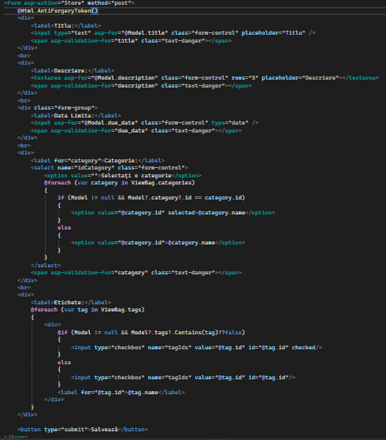
    vizualizarea:\
    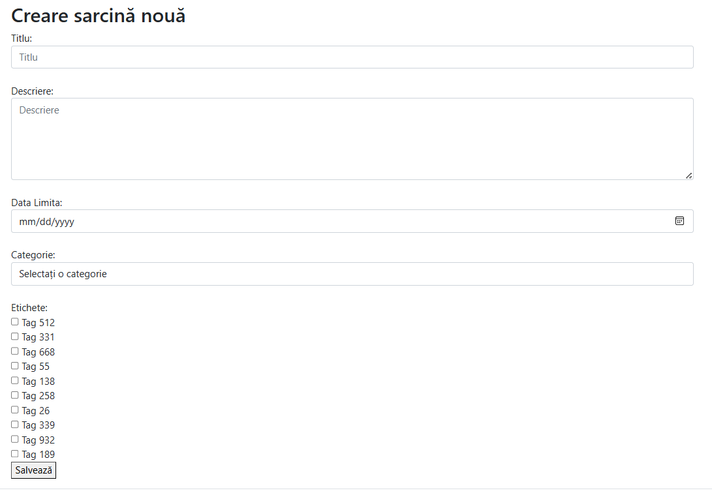
2. Actualizați controllerul TaskController:
    1. Adăugați metoda create, care returnează vizualizarea cu formularul.
    2. Adăugați metoda store, care procesează datele din formular și le salvează.\
    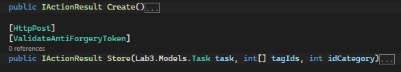

## Sarcina Nr. 2. Validarea datelor pe partea de server
Datele validate in clasa task:\
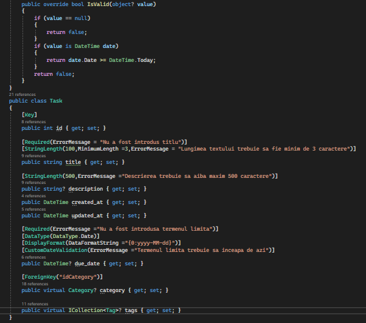

Metoda store() a controlerului task:\
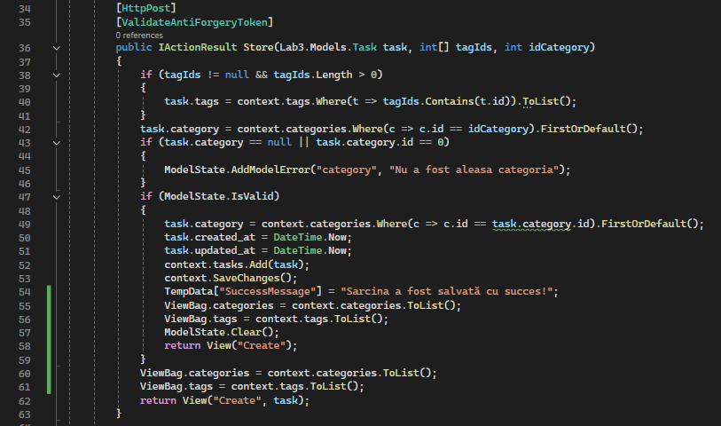

Reprezentarea in vizualizare:\
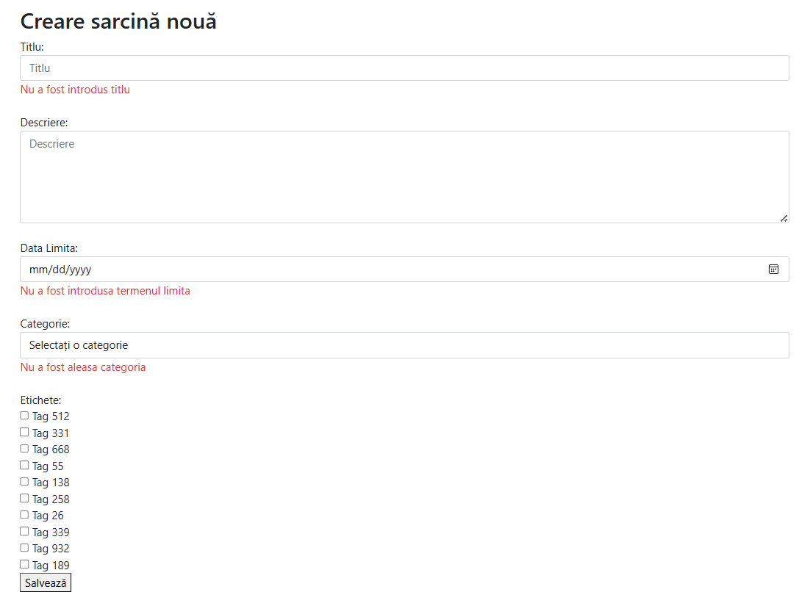

## Sarcina Nr. 3. Validarea datelor pe partea de server
1. Actualizați formularul HTML pentru a afișa un mesaj de confirmare la salvarea cu succes a sarcinii (mesaj flash).
2. Actualizați metoda store a controllerului TaskController pentru a adăuga un mesaj flash la salvarea cu succes a sarcinii.

Afișarea mesajului:
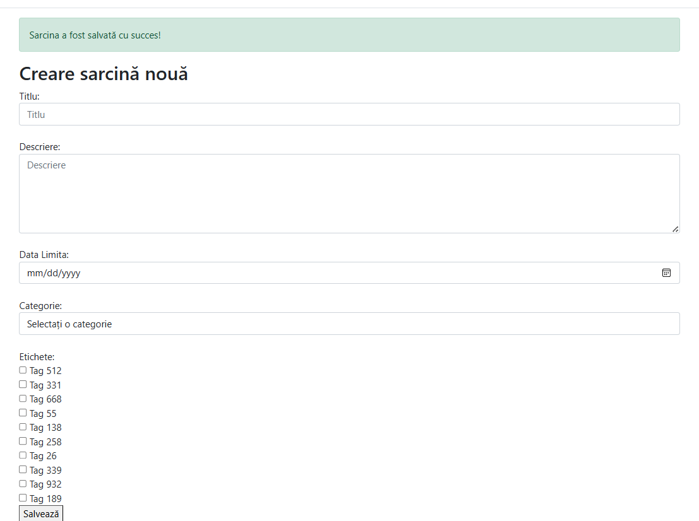

Cum a fost implementat:
- În moetoda store:
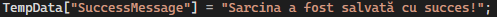

- În vizualizare:\
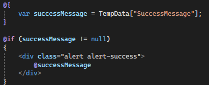

## Sarcina Nr. 4. Protecția împotriva CSRF
- Adăugați directiva @csrf în formular pentru protecția împotriva atacurilor CSRF.\
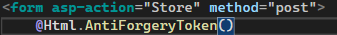
- Asigurați-vă că formularul este trimis doar prin metoda POST.\
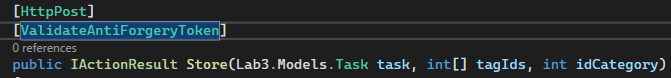

## Sarcina Nr. 5. Actualizarea sarcinii
1. Adăugați posibilitatea de editare a sarcinii:
    Vizualizarea Edit(cod):\
    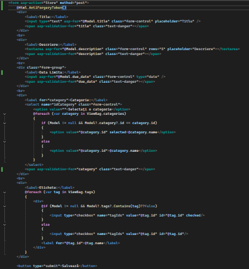

    Vizualizarea Edit(la execuție):\
    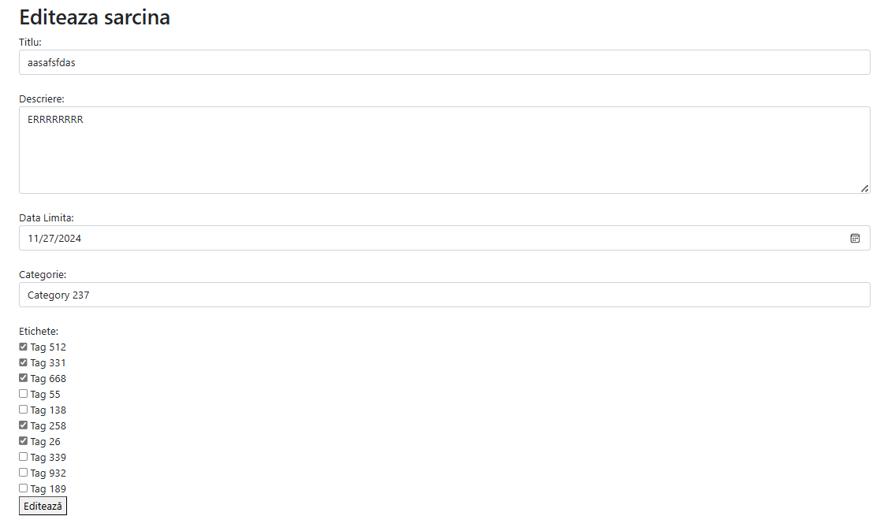

    Metoda Update() cu validarea datelor:\
    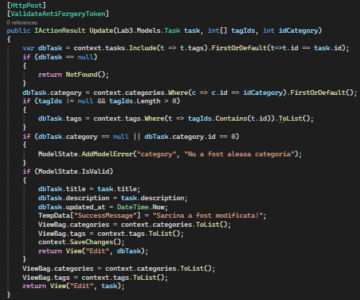